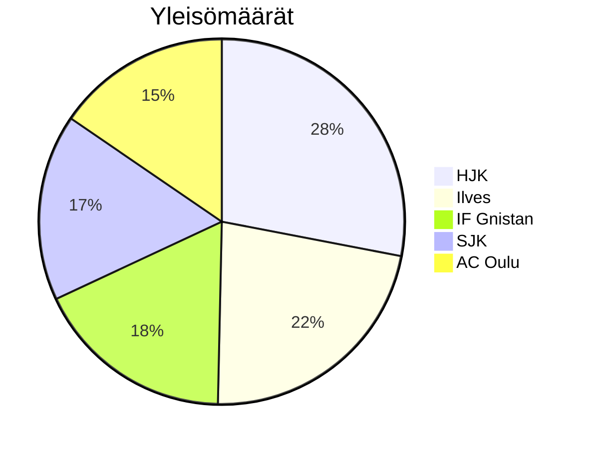

# Veikkausliiga 2025 - Tilastot

*Päivitetty: 24.04.2025 08:19*

## 📊 Liigatilastot
| Statistiikka | Arvo |
|--------------|------|
| Pelatut ottelut | 20 |
| Yhteensä maaleja | 59 |
| Maaleja per ottelu | 3.0 |
| Yli 2.5 maalin otteluita | 11 (55.0%) |
| Yleisöä yhteensä | 58,421 |
| Keskimääräinen yleisömäärä | 2921 |
| Suurin yleisömäärä | 7,651 |

## 🏆 Joukkuekohtaiset tilastot
### AC Oulu
#### 🏠 Kotipelit
| Statistiikka | Arvo |
|--------------|------|
| Otteluita | 0 |
| Tehdyt maalit | 0 |
| Päästetyt maalit | 0 |
| Yli 2.5 maalia | 0 (0.0%) |
| Keskiverto yleisö | 0 |
| Yli 2000 katsojaa | 0 |

#### ✈️ Vieraspelit
| Statistiikka | Arvo |
|--------------|------|
| Otteluita | 4 |
| Tehdyt maalit | 5 |
| Päästetyt maalit | 10 |
| Yli 2.5 maalia | 3 (75.0%) |
| Keskiverto yleisö | 2469 |
| Yli 2000 katsojaa | 3 |

### FC Haka
#### 🏠 Kotipelit
| Statistiikka | Arvo |
|--------------|------|
| Otteluita | 3 |
| Tehdyt maalit | 5 |
| Päästetyt maalit | 4 |
| Yli 2.5 maalia | 2 (66.7%) |
| Keskiverto yleisö | 2569 |
| Yli 2000 katsojaa | 3 |

#### ✈️ Vieraspelit
| Statistiikka | Arvo |
|--------------|------|
| Otteluita | 0 |
| Tehdyt maalit | 0 |
| Päästetyt maalit | 0 |
| Yli 2.5 maalia | 0 (0.0%) |
| Keskiverto yleisö | 0 |
| Yli 2000 katsojaa | 0 |

### FC Inter
#### 🏠 Kotipelit
| Statistiikka | Arvo |
|--------------|------|
| Otteluita | 2 |
| Tehdyt maalit | 4 |
| Päästetyt maalit | 1 |
| Yli 2.5 maalia | 1 (50.0%) |
| Keskiverto yleisö | 3152 |
| Yli 2000 katsojaa | 2 |

#### ✈️ Vieraspelit
| Statistiikka | Arvo |
|--------------|------|
| Otteluita | 1 |
| Tehdyt maalit | 2 |
| Päästetyt maalit | 0 |
| Yli 2.5 maalia | 0 (0.0%) |
| Keskiverto yleisö | 2481 |
| Yli 2000 katsojaa | 1 |

### FF Jaro
#### 🏠 Kotipelit
| Statistiikka | Arvo |
|--------------|------|
| Otteluita | 0 |
| Tehdyt maalit | 0 |
| Päästetyt maalit | 0 |
| Yli 2.5 maalia | 0 (0.0%) |
| Keskiverto yleisö | 0 |
| Yli 2000 katsojaa | 0 |

#### ✈️ Vieraspelit
| Statistiikka | Arvo |
|--------------|------|
| Otteluita | 3 |
| Tehdyt maalit | 3 |
| Päästetyt maalit | 3 |
| Yli 2.5 maalia | 1 (33.3%) |
| Keskiverto yleisö | 2417 |
| Yli 2000 katsojaa | 2 |

### HJK
#### 🏠 Kotipelit
| Statistiikka | Arvo |
|--------------|------|
| Otteluita | 1 |
| Tehdyt maalit | 0 |
| Päästetyt maalit | 1 |
| Yli 2.5 maalia | 0 (0.0%) |
| Keskiverto yleisö | 6220 |
| Yli 2000 katsojaa | 1 |

#### ✈️ Vieraspelit
| Statistiikka | Arvo |
|--------------|------|
| Otteluita | 2 |
| Tehdyt maalit | 2 |
| Päästetyt maalit | 4 |
| Yli 2.5 maalia | 1 (50.0%) |
| Keskiverto yleisö | 5850 |
| Yli 2000 katsojaa | 2 |

### IF Gnistan
#### 🏠 Kotipelit
| Statistiikka | Arvo |
|--------------|------|
| Otteluita | 0 |
| Tehdyt maalit | 0 |
| Päästetyt maalit | 0 |
| Yli 2.5 maalia | 0 (0.0%) |
| Keskiverto yleisö | 0 |
| Yli 2000 katsojaa | 0 |

#### ✈️ Vieraspelit
| Statistiikka | Arvo |
|--------------|------|
| Otteluita | 3 |
| Tehdyt maalit | 3 |
| Päästetyt maalit | 6 |
| Yli 2.5 maalia | 2 (66.7%) |
| Keskiverto yleisö | 3774 |
| Yli 2000 katsojaa | 3 |

### IFK Mariehamn
#### 🏠 Kotipelit
| Statistiikka | Arvo |
|--------------|------|
| Otteluita | 2 |
| Tehdyt maalit | 1 |
| Päästetyt maalit | 4 |
| Yli 2.5 maalia | 1 (50.0%) |
| Keskiverto yleisö | 1116 |
| Yli 2000 katsojaa | 0 |

#### ✈️ Vieraspelit
| Statistiikka | Arvo |
|--------------|------|
| Otteluita | 2 |
| Tehdyt maalit | 2 |
| Päästetyt maalit | 4 |
| Yli 2.5 maalia | 1 (50.0%) |
| Keskiverto yleisö | 2116 |
| Yli 2000 katsojaa | 1 |

### Ilves
#### 🏠 Kotipelit
| Statistiikka | Arvo |
|--------------|------|
| Otteluita | 2 |
| Tehdyt maalit | 5 |
| Päästetyt maalit | 3 |
| Yli 2.5 maalia | 2 (100.0%) |
| Keskiverto yleisö | 5776 |
| Yli 2000 katsojaa | 2 |

#### ✈️ Vieraspelit
| Statistiikka | Arvo |
|--------------|------|
| Otteluita | 1 |
| Tehdyt maalit | 5 |
| Päästetyt maalit | 0 |
| Yli 2.5 maalia | 1 (100.0%) |
| Keskiverto yleisö | 2715 |
| Yli 2000 katsojaa | 1 |

### KTP
#### 🏠 Kotipelit
| Statistiikka | Arvo |
|--------------|------|
| Otteluita | 3 |
| Tehdyt maalit | 2 |
| Päästetyt maalit | 8 |
| Yli 2.5 maalia | 2 (66.7%) |
| Keskiverto yleisö | 2238 |
| Yli 2000 katsojaa | 2 |

#### ✈️ Vieraspelit
| Statistiikka | Arvo |
|--------------|------|
| Otteluita | 0 |
| Tehdyt maalit | 0 |
| Päästetyt maalit | 0 |
| Yli 2.5 maalia | 0 (0.0%) |
| Keskiverto yleisö | 0 |
| Yli 2000 katsojaa | 0 |

### KuPS
#### 🏠 Kotipelit
| Statistiikka | Arvo |
|--------------|------|
| Otteluita | 3 |
| Tehdyt maalit | 6 |
| Päästetyt maalit | 1 |
| Yli 2.5 maalia | 1 (33.3%) |
| Keskiverto yleisö | 1887 |
| Yli 2000 katsojaa | 1 |

#### ✈️ Vieraspelit
| Statistiikka | Arvo |
|--------------|------|
| Otteluita | 1 |
| Tehdyt maalit | 1 |
| Päästetyt maalit | 1 |
| Yli 2.5 maalia | 0 (0.0%) |
| Keskiverto yleisö | 3837 |
| Yli 2000 katsojaa | 1 |

### SJK
#### 🏠 Kotipelit
| Statistiikka | Arvo |
|--------------|------|
| Otteluita | 2 |
| Tehdyt maalit | 4 |
| Päästetyt maalit | 1 |
| Yli 2.5 maalia | 1 (50.0%) |
| Keskiverto yleisö | 3650 |
| Yli 2000 katsojaa | 2 |

#### ✈️ Vieraspelit
| Statistiikka | Arvo |
|--------------|------|
| Otteluita | 2 |
| Tehdyt maalit | 3 |
| Päästetyt maalit | 1 |
| Yli 2.5 maalia | 1 (50.0%) |
| Keskiverto yleisö | 1627 |
| Yli 2000 katsojaa | 1 |

### VPS
#### 🏠 Kotipelit
| Statistiikka | Arvo |
|--------------|------|
| Otteluita | 2 |
| Tehdyt maalit | 4 |
| Päästetyt maalit | 5 |
| Yli 2.5 maalia | 1 (50.0%) |
| Keskiverto yleisö | 2364 |
| Yli 2000 katsojaa | 2 |

#### ✈️ Vieraspelit
| Statistiikka | Arvo |
|--------------|------|
| Otteluita | 1 |
| Tehdyt maalit | 2 |
| Päästetyt maalit | 2 |
| Yli 2.5 maalia | 1 (100.0%) |
| Keskiverto yleisö | 1755 |
| Yli 2000 katsojaa | 0 |

