# Veikkausliiga 2025 - Tilastot

*Päivitetty: 24.04.2025 09:03*

## 📊 Liigatilastot
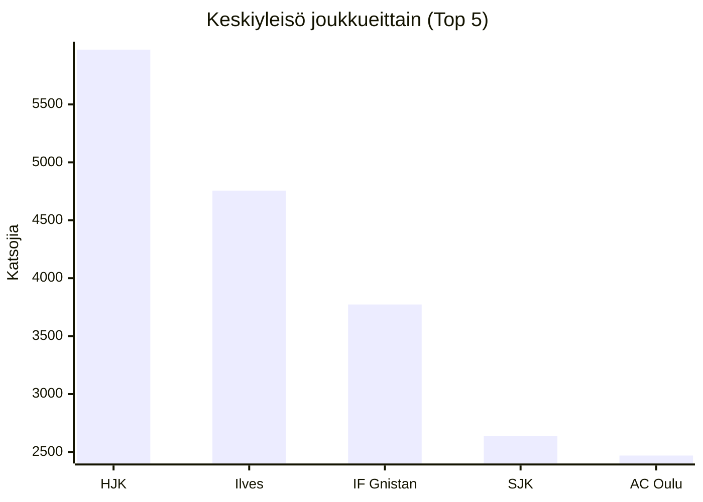
```mermaid
xychart-beta
    title "Keskiyleisö joukkueittain (Top 5)"
    x-axis ["HJK", "Ilves", "IF Gnistan", "SJK", "AC Oulu"]
    y-axis "Katsojia"
    bar [5973, 4756, 3773, 2638, 2469]
```

## 📈 Yleisömäärät
```mermaid
xychart-beta
    title "Koti vs Vieras -keskiyleisö (Top 5)"
    x-axis ["HJK", "Ilves", "IF Gnistan", "SJK", "AC Oulu"]
    y-axis "Katsojia"
    bar "Koti"
        [6220, 5776, 0, 3649, 0]
    bar "Vieras"
        [5849, 2715, 3773, 1627, 2469]
```

## ⚽ Maalit
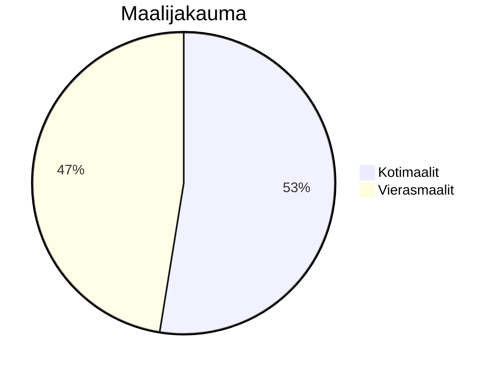
```mermaid
pie title Maalijakauma
    "Kotimaalit" : 31
    "Vierasmaalit" : 28
```

## 🏆 Joukkuekohtaiset tilastot
### 🏟️ AC Oulu

```mermaid
pie title AC Oulu - Yleisöjakauma
    "Kotipelit" : 0
    "Vieraspelit" : 9876
```
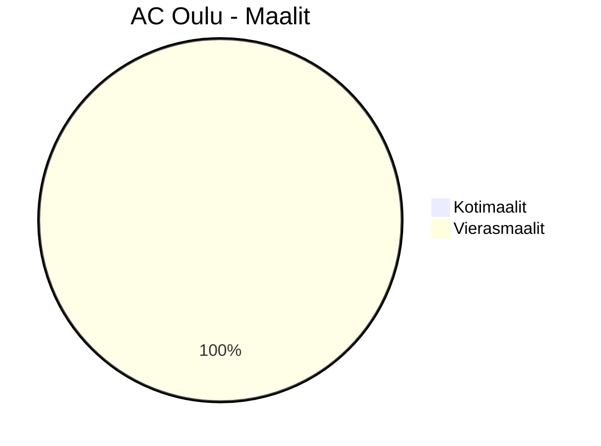
```mermaid
pie title AC Oulu - Maalit
    "Kotimaalit" : 0
    "Vierasmaalit" : 5
```
### 📊 Vertailu
| Statistiikka | Koti | Vieras |
|--------------|------|--------|
| Otteluita | 0 | 4 |
| Keskiyleisö | 0 | 2469 |
| Maalit (tehty/päästetty) | 0-0 | 5-10 |
| Yli 2.5 maalia | 0 (0.0%) | 3 (75.0%) |

### 🏟️ FC Haka
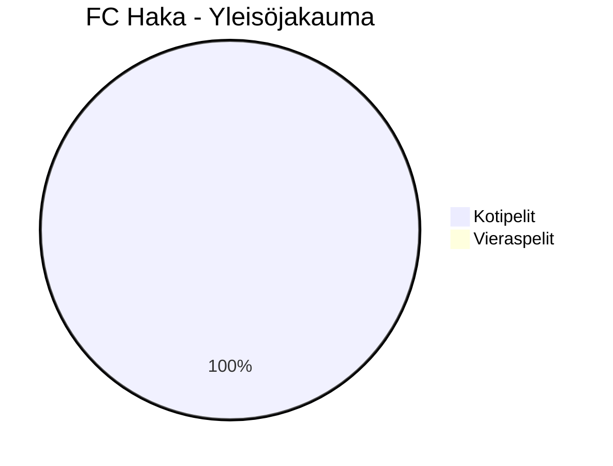
```mermaid
pie title FC Haka - Yleisöjakauma
    "Kotipelit" : 7708
    "Vieraspelit" : 0
```
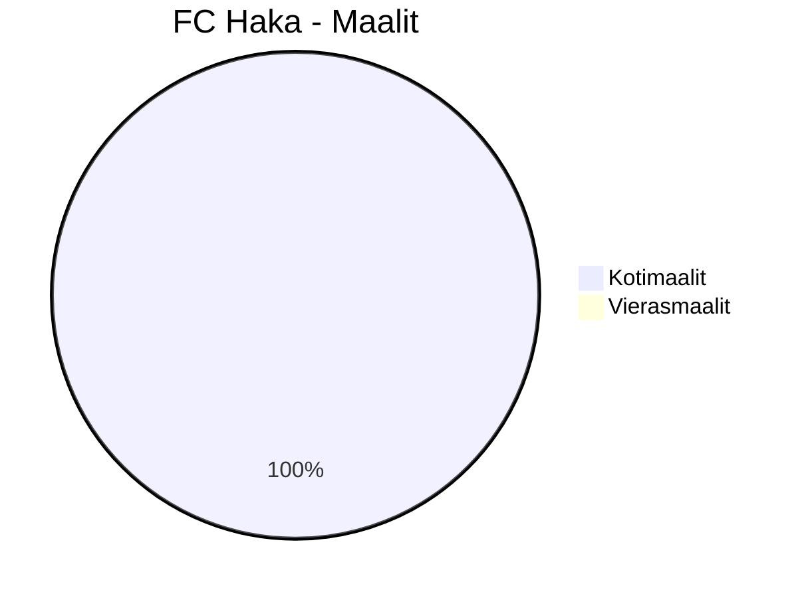
```mermaid
pie title FC Haka - Maalit
    "Kotimaalit" : 5
    "Vierasmaalit" : 0
```
### 📊 Vertailu
| Statistiikka | Koti | Vieras |
|--------------|------|--------|
| Otteluita | 3 | 0 |
| Keskiyleisö | 2569 | 0 |
| Maalit (tehty/päästetty) | 5-4 | 0-0 |
| Yli 2.5 maalia | 2 (66.7%) | 0 (0.0%) |

### 🏟️ FC Inter
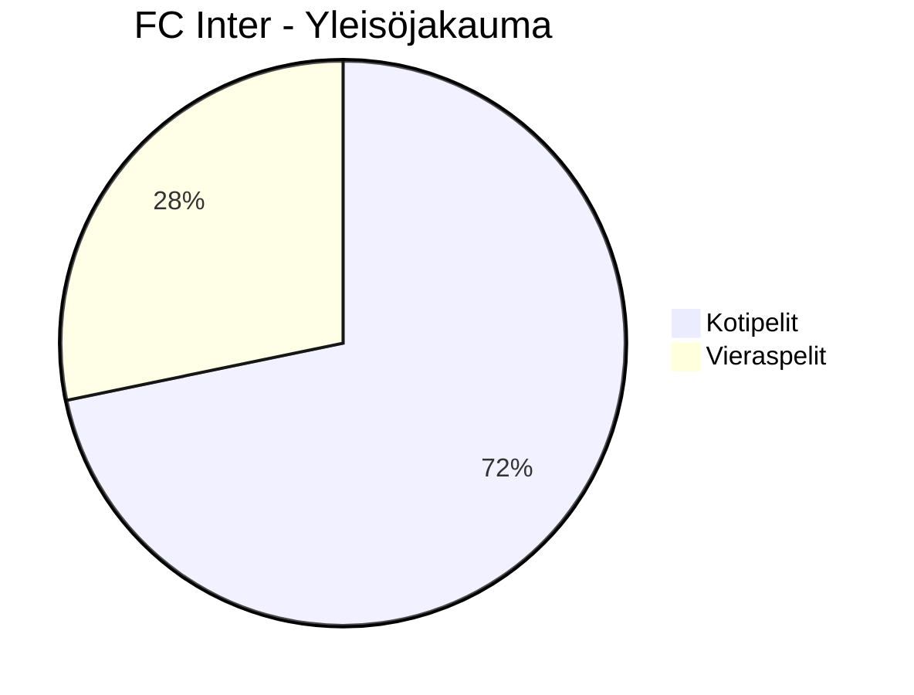
```mermaid
pie title FC Inter - Yleisöjakauma
    "Kotipelit" : 6303
    "Vieraspelit" : 2481
```
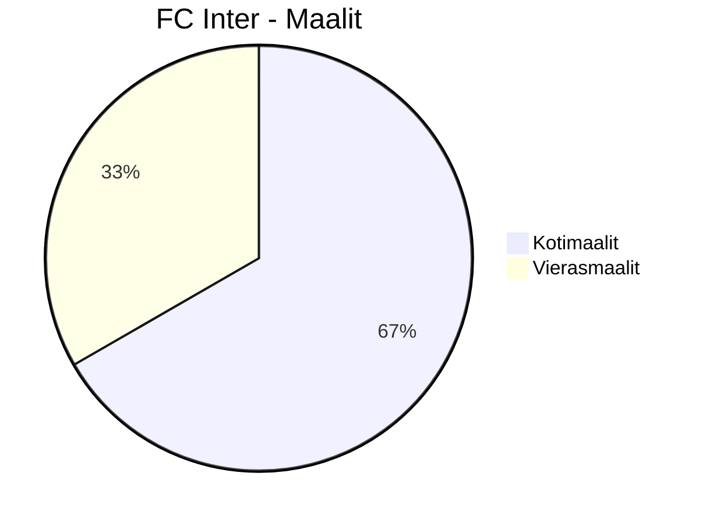
```mermaid
pie title FC Inter - Maalit
    "Kotimaalit" : 4
    "Vierasmaalit" : 2
```
### 📊 Vertailu
| Statistiikka | Koti | Vieras |
|--------------|------|--------|
| Otteluita | 2 | 1 |
| Keskiyleisö | 3152 | 2481 |
| Maalit (tehty/päästetty) | 4-1 | 2-0 |
| Yli 2.5 maalia | 1 (50.0%) | 0 (0.0%) |

### 🏟️ FF Jaro
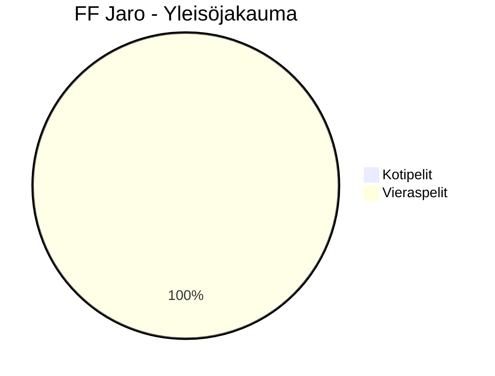
```mermaid
pie title FF Jaro - Yleisöjakauma
    "Kotipelit" : 0
    "Vieraspelit" : 7250
```
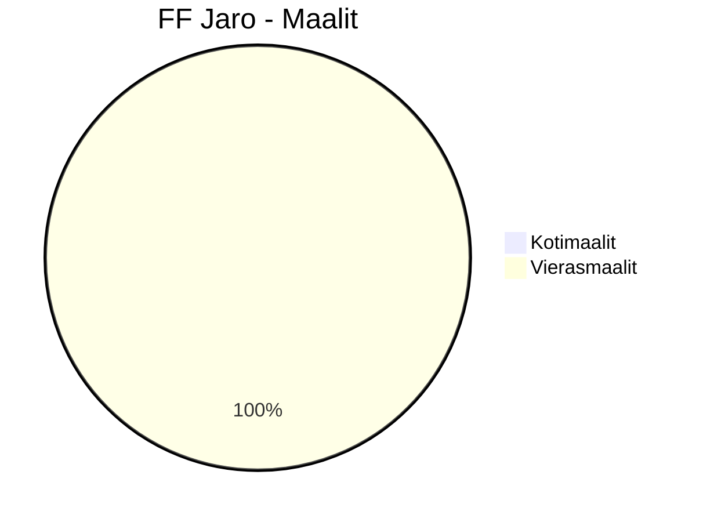
```mermaid
pie title FF Jaro - Maalit
    "Kotimaalit" : 0
    "Vierasmaalit" : 3
```
### 📊 Vertailu
| Statistiikka | Koti | Vieras |
|--------------|------|--------|
| Otteluita | 0 | 3 |
| Keskiyleisö | 0 | 2417 |
| Maalit (tehty/päästetty) | 0-0 | 3-3 |
| Yli 2.5 maalia | 0 (0.0%) | 1 (33.3%) |

### 🏟️ HJK
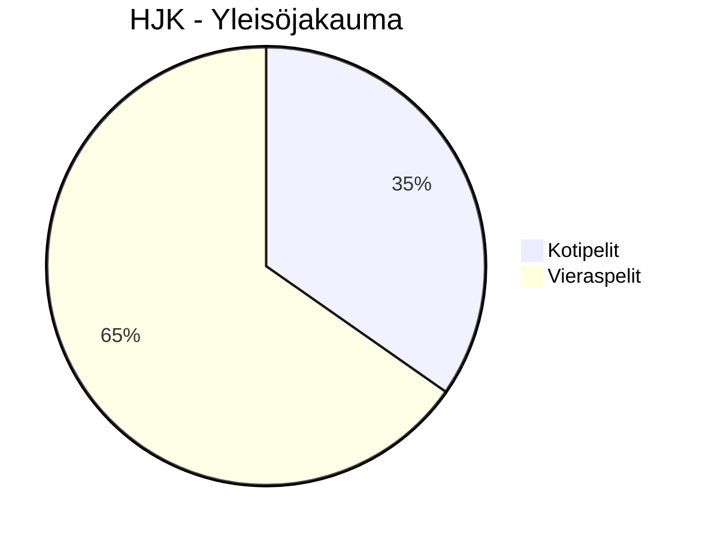
```mermaid
pie title HJK - Yleisöjakauma
    "Kotipelit" : 6220
    "Vieraspelit" : 11699
```
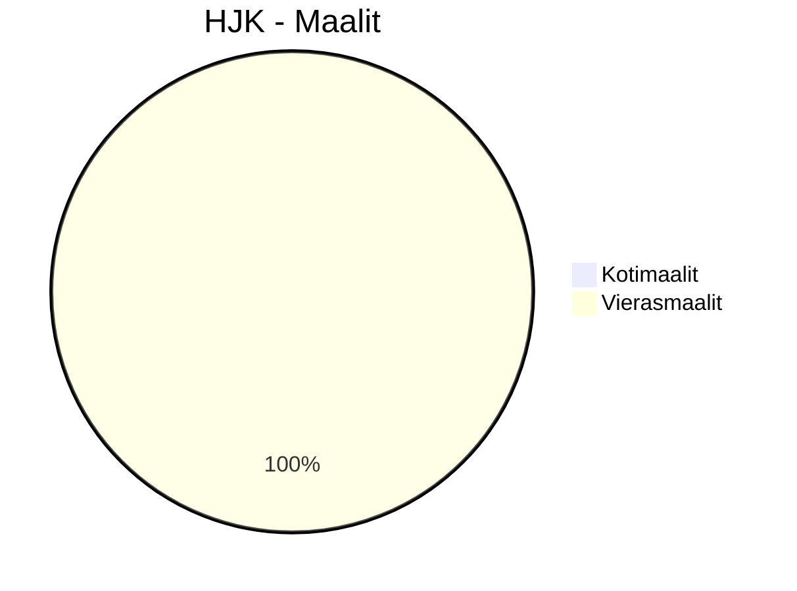
```mermaid
pie title HJK - Maalit
    "Kotimaalit" : 0
    "Vierasmaalit" : 2
```
### 📊 Vertailu
| Statistiikka | Koti | Vieras |
|--------------|------|--------|
| Otteluita | 1 | 2 |
| Keskiyleisö | 6220 | 5850 |
| Maalit (tehty/päästetty) | 0-1 | 2-4 |
| Yli 2.5 maalia | 0 (0.0%) | 1 (50.0%) |

### 🏟️ IF Gnistan
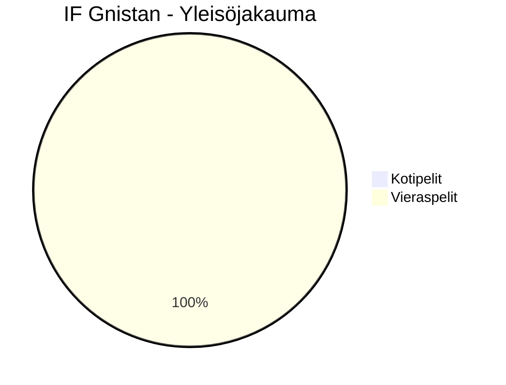
```mermaid
pie title IF Gnistan - Yleisöjakauma
    "Kotipelit" : 0
    "Vieraspelit" : 11321
```
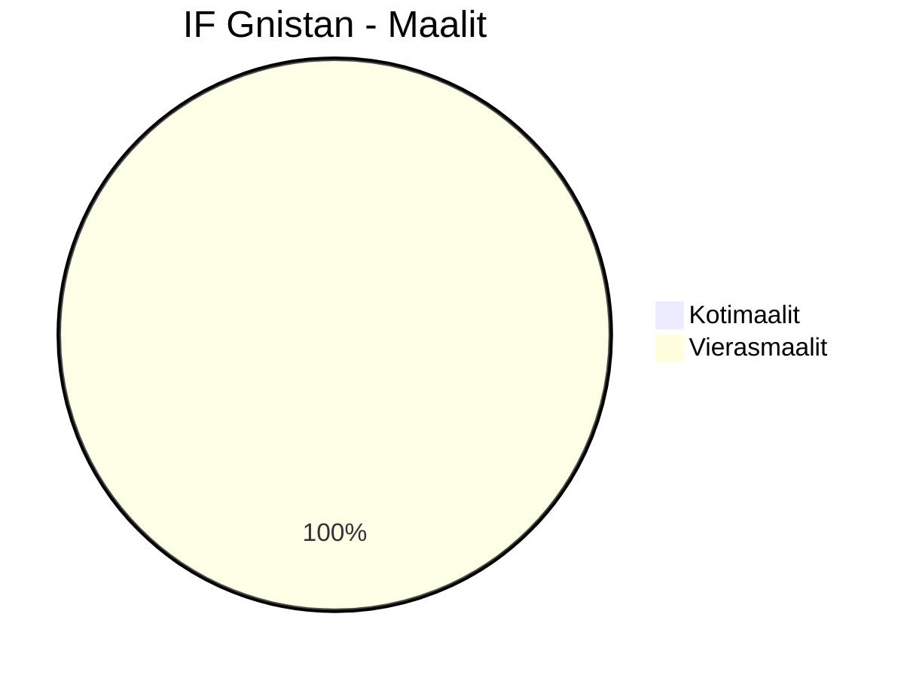
```mermaid
pie title IF Gnistan - Maalit
    "Kotimaalit" : 0
    "Vierasmaalit" : 3
```
### 📊 Vertailu
| Statistiikka | Koti | Vieras |
|--------------|------|--------|
| Otteluita | 0 | 3 |
| Keskiyleisö | 0 | 3774 |
| Maalit (tehty/päästetty) | 0-0 | 3-6 |
| Yli 2.5 maalia | 0 (0.0%) | 2 (66.7%) |

### 🏟️ IFK Mariehamn
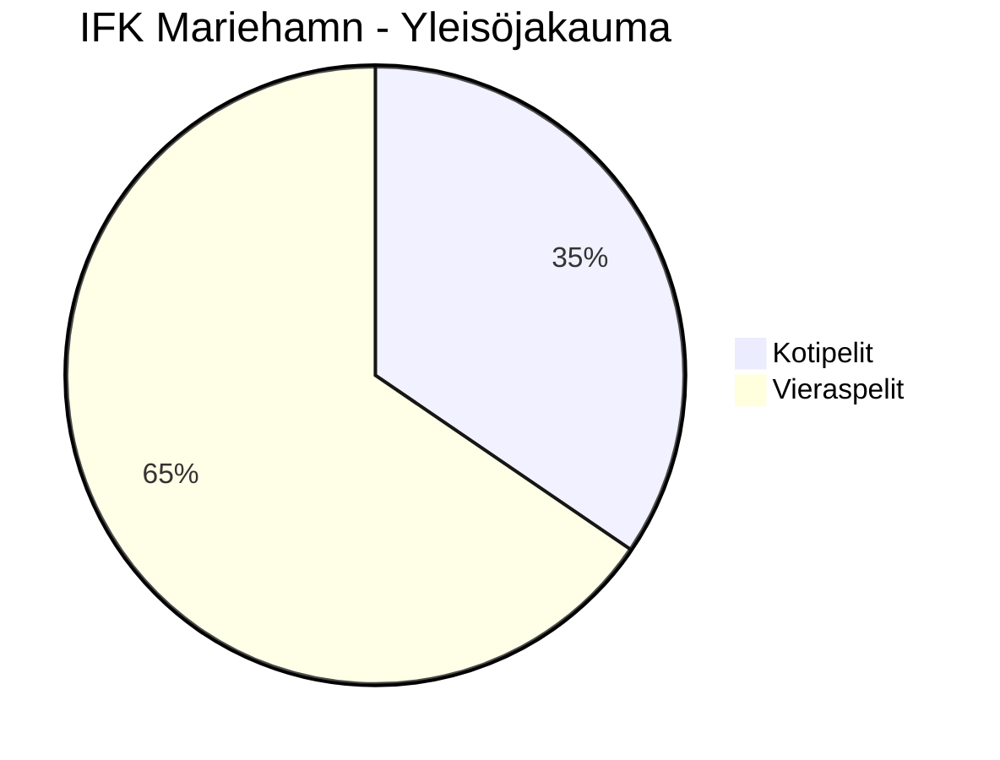
```mermaid
pie title IFK Mariehamn - Yleisöjakauma
    "Kotipelit" : 2233
    "Vieraspelit" : 4233
```
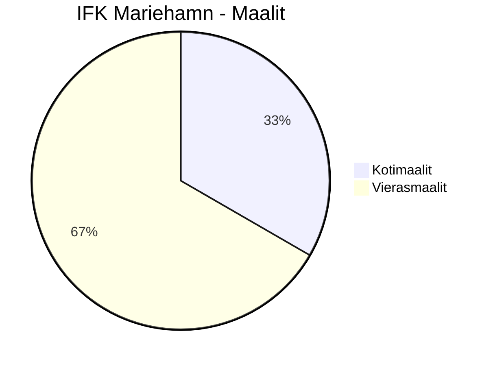
```mermaid
pie title IFK Mariehamn - Maalit
    "Kotimaalit" : 1
    "Vierasmaalit" : 2
```
### 📊 Vertailu
| Statistiikka | Koti | Vieras |
|--------------|------|--------|
| Otteluita | 2 | 2 |
| Keskiyleisö | 1116 | 2116 |
| Maalit (tehty/päästetty) | 1-4 | 2-4 |
| Yli 2.5 maalia | 1 (50.0%) | 1 (50.0%) |

### 🏟️ Ilves
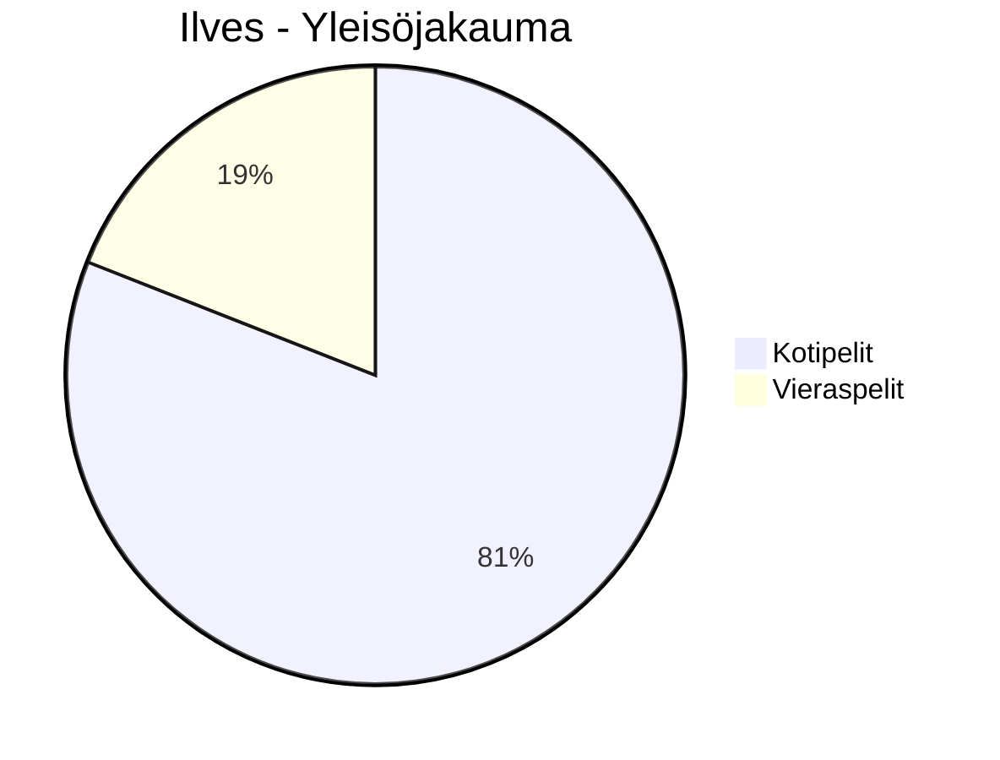
```mermaid
pie title Ilves - Yleisöjakauma
    "Kotipelit" : 11553
    "Vieraspelit" : 2715
```
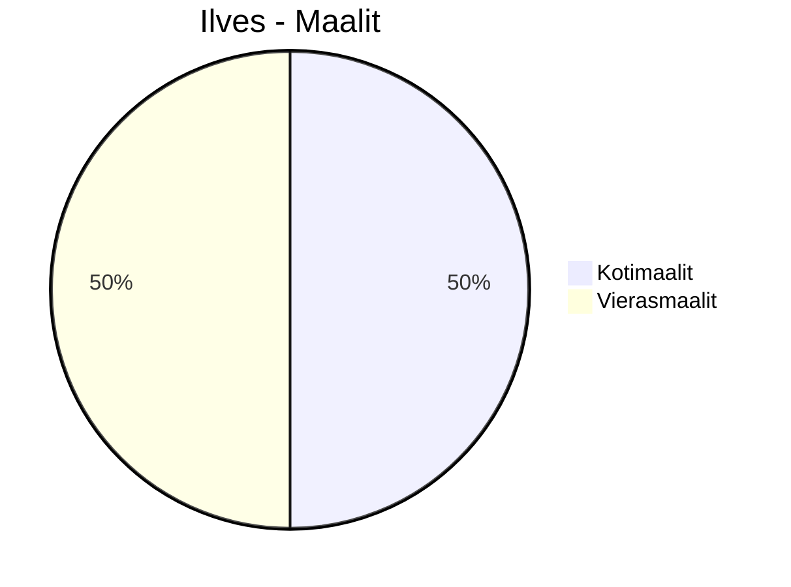
```mermaid
pie title Ilves - Maalit
    "Kotimaalit" : 5
    "Vierasmaalit" : 5
```
### 📊 Vertailu
| Statistiikka | Koti | Vieras |
|--------------|------|--------|
| Otteluita | 2 | 1 |
| Keskiyleisö | 5776 | 2715 |
| Maalit (tehty/päästetty) | 5-3 | 5-0 |
| Yli 2.5 maalia | 2 (100.0%) | 1 (100.0%) |

### 🏟️ KTP
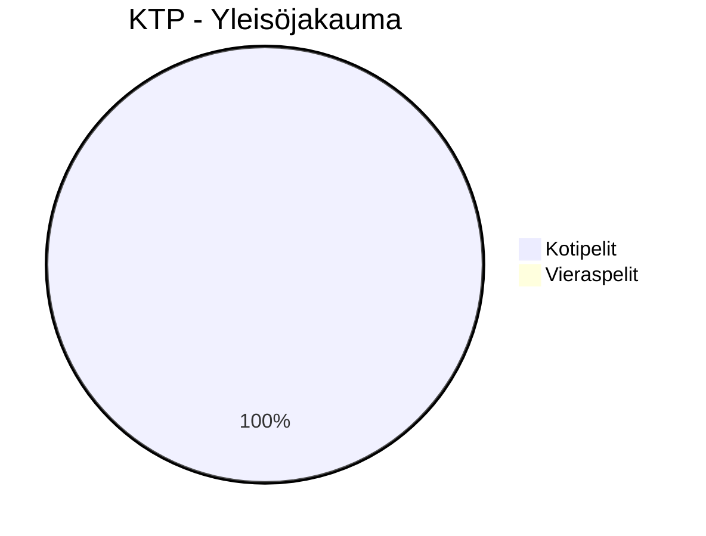
```mermaid
pie title KTP - Yleisöjakauma
    "Kotipelit" : 6715
    "Vieraspelit" : 0
```
```mermaid
pie title KTP - Maalit
    "Kotimaalit" : 2
    "Vierasmaalit" : 0
```
### 📊 Vertailu
| Statistiikka | Koti | Vieras |
|--------------|------|--------|
| Otteluita | 3 | 0 |
| Keskiyleisö | 2238 | 0 |
| Maalit (tehty/päästetty) | 2-8 | 0-0 |
| Yli 2.5 maalia | 2 (66.7%) | 0 (0.0%) |

### 🏟️ KuPS
```mermaid
pie title KuPS - Yleisöjakauma
    "Kotipelit" : 5661
    "Vieraspelit" : 3837
```
```mermaid
pie title KuPS - Maalit
    "Kotimaalit" : 6
    "Vierasmaalit" : 1
```
### 📊 Vertailu
| Statistiikka | Koti | Vieras |
|--------------|------|--------|
| Otteluita | 3 | 1 |
| Keskiyleisö | 1887 | 3837 |
| Maalit (tehty/päästetty) | 6-1 | 1-1 |
| Yli 2.5 maalia | 1 (33.3%) | 0 (0.0%) |

### 🏟️ SJK
```mermaid
pie title SJK - Yleisöjakauma
    "Kotipelit" : 7299
    "Vieraspelit" : 3254
```
```mermaid
pie title SJK - Maalit
    "Kotimaalit" : 4
    "Vierasmaalit" : 3
```
### 📊 Vertailu
| Statistiikka | Koti | Vieras |
|--------------|------|--------|
| Otteluita | 2 | 2 |
| Keskiyleisö | 3650 | 1627 |
| Maalit (tehty/päästetty) | 4-1 | 3-1 |
| Yli 2.5 maalia | 1 (50.0%) | 1 (50.0%) |

### 🏟️ VPS
```mermaid
pie title VPS - Yleisöjakauma
    "Kotipelit" : 4729
    "Vieraspelit" : 1755
```
```mermaid
pie title VPS - Maalit
    "Kotimaalit" : 4
    "Vierasmaalit" : 2
```
### 📊 Vertailu
| Statistiikka | Koti | Vieras |
|--------------|------|--------|
| Otteluita | 2 | 1 |
| Keskiyleisö | 2364 | 1755 |
| Maalit (tehty/päästetty) | 4-5 | 2-2 |
| Yli 2.5 maalia | 1 (50.0%) | 1 (100.0%) |

